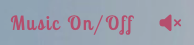
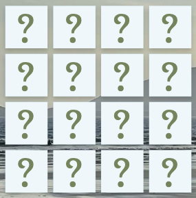

# PROJECT MEMOVOCABS

## Table of Content

- [About the project](#about-the-project)
- [Features](#features)
  - [Existing Features](#existing-features)
  - [Features left to implement](#features-left-to-implement)
- [Testing](#testing)
  - [Validator Testing](#validator-testing)
  - [Unfixed Bugs](#unfixed-bugs)
- [Deployment](#deployment)
  - [Local Deployment](#local-deployment)
  - [Publishing](#publishing)
- [Credits](#credits)
  - [Content](#content)
  - [Media](#media)
  - [Special Thanks](#special-thanks)
- [Author](#author)
- [License](#license)

## About this project

This project is a memory game with the added feature of familiatising the player with a few common English words or, if setup by a teacher, to do a recap of vocabulary covered during the lesson. The player has the choice between three sets of cards, gradually rising the level of difficulty as well as getting introduced to new words with each level. An additional option allows the player or teacher to enter their own vocabulary they want to practice. Cheerful and relaxing music adds to the fun of playing the game and rounds off the user experience.
The structure of the code allows for easy amendments to images and vocabulary displayed and is therefore easily transferrable to be used by another business.

  

## Features 

### Existing Features

- __The Background Image__

  - The beach displayed as background image is the actual location of Anne's Language Retreat and was chosen on purpose. The image shows the beauty of the location future or potential students will be staying at and acts as draw and key selling point for the place. It shows the students what they can look forward to or touches on memories of students who already stayed at the place and return to the game just for fun or to refresh their memory.

    

- __The Colour Palettes__

  - The color palettes used throughout the page are a soft autumn color palette for background and font combined with a palette of earth tons for the back of the cards.
  - Each colour scheme repeats the colours of the background image; both features combined create a harmonious overall picture.
  - Both colour schemes are easy on the eyes, the opposite to an often used clinical cold white, and are intended to remind the player/student of a warm and relaxing day spent on the beach.

         
  

- __The landing page__

  - TThe first impression the landing page greets the player with is a straight forward design with all elements important for the game play at display.
  - All important featuers, user input fields and game controls, are visible at a glance conveying the message of a game easy to play, anytime and everywhere.
  - Combined with the background image the large button "Enter Vocabulary" and the Logo of the business above communicate clearly to the player what the game is about and what the business has to offer.
  - The contact details are included in the footer with clickable hyperlinks to visit the busniess' website or send an email.

    

- __The Buttons__

  - There are four clickable buttons included in the landing page. All buttons are styled identically with the same transparent 3D-look and matching font.

  - Enter Vocabulary Button: This button openbs the vocabulary entry table to customise the game.

    

  - Reset Button: This button will reset the game after each round when clicked and is placed close to the game board. 
  
    

  - How to Play Button: This button opens a popup window which includes information about the game setup and game play.

    

  - Start Game Button: This button starts the game and triggers the board creation.

    

- __The Game Logo__
  - The game logo has been designed to fit smoothly into the background image and is refelecting the shades of blue from the background image.
  - The name of the game sports a cheecky pink with an olive green gradient from bottom to top to correspond with the overall colour scheme of the game.
  - The wavery borders give the logo an intended cartoon impression and the rectangle shape has a gradient fill from light blue to white which is running from the outer edges to the center giving the logo the depth of mirror which frames the name of the game nicely and mixes smoothly with the shadow of the letters.
  - The logo conveys the message that there is more to the game than the eyes can see, hidden features behind the obvious.  
  - The font used for the logo is Lucida Handwriting.

    

- __The Game Music__

  - The game music enhances the goal of providing a relaxing gaming environment. Both tracks used are instrumental.
  - The player is greeted with an ambient track to which they can calmly read through the game description and select their setup.
  - Once they start the game the music switches to an upbeat Ukulele song that carries the player through their first game.
  - When the player continues to player the game, the music switches randomly between both tracks.
  - The music is set to off by default and can be switched on by clicking on the volume icon located under the logo. The label "Music On/Off" guides the player there which is styled in a pink colour corresponding to the logo to continue the playful overall picture.

    

- __The Game Setup section__

  - The user input section is kept short and clear, the structure reflecting the underlying order in which the information has to be enetered. 
  - A label above each field informs the user about the purpose of the field and wether it is mandatory or optional.
  - Floating slightly transparent dropdown menus allow the player to choose between three different game boards and five different colours for the back of the cards.

      

- __The How-To-Play-Popup__

  - The How-To-Play-Popup includes all information needed about the game and how to navigate the different features.
  - The information is kept short and conise and explains how to fill in the form, the goal of the game, the two options how to play game, how the cards are flipped and the functions of the buttons.

    

- __The Enter-Vocabulary table__
  - This section allows the player to customise the game by entering the vocabulary they want to learn or for recap exercise.
  - The table has space for 12 word pairs.
  - Each field allows for a maximum of 25 characters to be entered so the player can not only enter single words but also collocations or short idioms.

    

- __The Game Board__
  - This section is for the game board. The player can choose between three different game boards with 12, 16 or 24 cards
  - The game board is fully responsive and adjusts horizontally and vertically in height and width to fit every screen, lanscape or portrait.

     
       

- __The cards__
  - The cards have a square shape and are also fully responsive.
  - The player can choose between five colours for the back of the cards: red, yellow, light blue, olive green and purple.
  - The back of the cards sports also an olive green question mark making the cards even more distintive.
  - The front of the cards comes either with a default image or can be customised. The number of characters that can be entered for the content is limited to 25 to ensure that the content remains readable even on the smallest screen.

    
         

- __The Footer__ 

  - The footer section includes links to the relevant social media sites for Anne's Language Retreat. The links will open to a new tab to allow easy navigation for the player.
  - The footer is valuable to the player as it encourages them to keep connected via social media.
  - The footer also includes the address and contact details for the business. 
  - Both, the website address and the email address are clickable to provide an opportunity for the player to visit the website of the business or send an email to them. The hyperlink linked to the website will open to a new tab, the hyperlink linked to the email address connects to the email app on the player's device.

      

### Features Left to Implement

- upgrade for the table to allow the upload of images or sounds

## Testing 

### Initial Checks

  ### Responsiveness

    This part of the testing was done in Lighthouse throughout the project to ensure the content of each page remained fully responsive and 100% visible after each amendment. The testing tool was set to the most common Samsung, Apple and Google products to cover the full range of screens from the smallest being the Galaxy fold Z 5 (344px) to a curved 27" external monitor.

  ### Functionality

  Features checked during testing included checking:

    Music controls

      - The music controls are located under the logo and consists the label MUsic On/Off and an interactive volume icon which switches between the icon for volumeX and volumeLoud when clicked.

    The input form

    The input form consists of four parts:

      -  The name input field: The name is a required input. If the player does not fill in this line a popup is displayed "FPlease fill out this field" when the "Start Game"-button is clicked.
      
      - The vocabulary input table: allows the player to customise the game by entering the vocabulary they want to learn or for recap exercise. 
      - The table is displayed in a popup window and has space for 12 word pairs.
      - Each field allows for a maximum of 25 characters to be entered so the player can not only enter single words but also collocations or short idioms.
      - All 24 fields need to be filled in order to continue.
      - There are two buttons at the bottom of the popup window: "Continue" which can only be clicked when all fields have been filled out and "Close" to cancel the input.

      - The Number-of-cards dropdown menu: Here the player can chooce between a board of 12, 16 or 24 cards.

      - The color-of-back dropdown menu allows the player to choose between five colours for the back of the card: red, yellow, light-blue, olive-green and purple.

    The buttons

      - Enter vocabulary: triggers a popup window when clicked and opens the vocabulary entry table
      - Start Game: starts a new game when clicked
      - Reset Game: clears the game board and entris from the form when clicked
      - How to play: triggers a popup window when clicked which displays information about the game setup and game play

    The game play
    
    - Clicking "Start game" triggers the creation of the board
    - Clicking on a card flips the card and the image or custom content is displayed
    - When two cards are clicked, the matching function compares the content and when it is a match the cards are not flipped back. 
    - When playing with the default set: additonally a popup window displays the message "Awesome! You found the first word! + vocable + phonetics" when it is the first pair and "Awesome! You found another word! + vocable + phonetics" for every pair found afterwards
    - When playing with the customer set: the messages remain the same but now the content the player is displayed underneath
    - The more cards are on the board, the more words the player will learn (from 6 with 12 cards to 12 with 24 cards)
    - The game is finished when all pairs have been matched and a popup is diplsayed with the message: "Congratulations! You found them all! Great job!"    
    - "Reset Game" will clear the board and content from the form. Clicking "Reset game"is mandatory to ensure the correct messages are displayed upon finding the pairs.

### User Testing

    - The user experience is essential so I selected a group of 15 people (colleagues, friends, relatives, fellow teachers) of different age groups (12 - 72 years) to test how intuitive and easy to understand the setup and game play is.

    - The insides provided helped me to further improve the layout and features, it actually let to me implementing the vocabulary table, and it was also another vey good test to check if the game is playable and all links and buttons are clickable on different devices, each set to the personal preferences of its owner.

    - The group reacted very well to the colour scheme and confirmed the colours gave them a homey and comfy feeling while playing the game.

    - The music was also very well received.

### Testing of Performance, Accessibility, Best Practice, SEO

  - Tools used: Lighthouse, catchpoint

  #### test results for desktop: 99% 

  

  #### test results for mobile: 91%

  

 - bugs identified and solved: content exceeding the margins of the customCards, final message displayed randomly, images not uploaded

  - I countered the errors by 
    - implementing font-size: clamp;, word-break: break: word; and overflow properties in the CSS style sheet
    - identified the error of the final message being displayed randomly during rounds after the first as result from not clicking "Reset Game"
    - took out the feature image-upload

  - The game has a lower performance level on older devices such as iPhoneXR or Galaxy S5 where the performance is only at 82% but still runs smoothly except the flip of the card after the click being slightly delayed.

### Validator Testing 

- HTML
  - No errors were returned when passing through the official [W3C validator](https://validator.w3.org/nu/?doc=https%3A%2F%2Fmerzann.github.io%2FMemoVocabs%2F)
- CSS
  - No errors were found when passing through the official [W3C CSS validator](https://jigsaw.w3.org/css-validator/validator?uri=https%3A%2F%2Fmerzann.github.io%2FMemoVocabs%2F&profile=css3svg&usermedium=all&warning=1&vextwarning=&lang=en)

### Unfixed Bugs

    All implemented elements are working as exspected. No bugs found during testing.
    

## Deployment

  ### Local Deployment

      MacBook-Air:~ annikamerz$ git clone https://github.com/merzann/MemoVocabs.git
      Cloning into 'MemoVocabs'...
      remote: Enumerating objects: 134, done.
      remote: Counting objects: 100% (134/134), done.
      remote: Compressing objects: 100% (84/84), done.
      remote: Total 134 (delta 42), reused 126 (delta 35), pack-reused 0
      Receiving objects: 100% (134/134), 20.90 MiB | 10.89 MiB/s, done.
      Resolving deltas: 100% (42/42), done.
      MacBook-Air:~ annikamerz$ cd MemoVocabs
      MacBook-Air:MemoVocabs annikamerz$ ls
      README.md	assets		index.html
      MacBook-Air:MemoVocabs annikamerz$ ls -a
      .			.gitpod.dockerfile	assets
      ..			.gitpod.yml		index.html
      .git			.vscode
      .gitignore		README.md
      MacBook-Air:MemoVocabs annikamerz$ git status
      On branch main
      Your branch is up to date with 'origin/main'.

      nothing to commit, working tree clean
      MacBook-Air:MemoVocabs annikamerz$ 

  ### Publishing

    - The site was deployed to GitHub pages. The steps to deploy are as follows: 
    - In the GitHub repository, navigate to the Settings tab 
    - From the source section drop-down menu, select the Master Branch
    - Once the master branch has been selected, the page will be automatically refreshed with a detailed ribbon display to indicate the successful deployment. 

The live link can be found here - https://merzann.github.io/MemoVocabs/

## Acknowledgement

### Content 

  - The template used for building this project was provided by Code Institute on Github for student projects [ci-full-template](https://github.com/Code-Institute-Org/ci-full-template/)
- The icons in the footer and the volume icons were taken from [Font Awesome](https://fontawesome.com/)
- The color palettes used were created by color-hex [color-hex](https://www.color-hex.com/autumn-color-palettes/)
- The favicon was created in [favicon.io](https://favicon.io/)
- Instructions and ideas on how to navigate Javascript and build HTMLforms were taken from Austin Gil's blog [Austin Gil Blog](https://austingil.com/building-super-powered-html-forms-with-javascript/)

### Media

- The photo used as background image belong to me, all rights reservered
- The logo was create by me using MS Powerpoint, all rights reserved

### Special Thanks

- Katja Ehrsam for testing the code and the page thoroughly and helping me identify bugs I had missed or not thought of
- A big thank you again to the group of test users for reviewing the game from a customer's perspective and providing valuable Feedback

## Author

- [merzann](https://github.com/merzann)

## License

